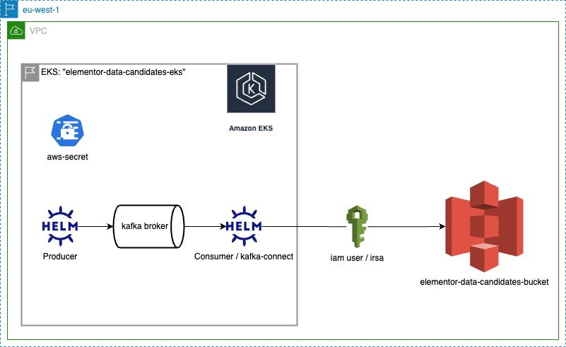

# Data Devops Candidates Home Assignment

## Prequisites

1. `awscli`
2. `helm`
3. `docker` or equivalent
4. Dockerhub Account (or equivalent)
4. Credentials for candidates EKS cluster (Supplied by email)

## Final Solution
---

## Instructions
---

The purpose of this home assignment is to test basic knowledge with `AWS` and `Kuebernetes (EKS)`. In addition, this assignment will test how you handle some basic data technologies and understand the integrations.

Make sure to [configure](https://docs.aws.amazon.com/cli/latest/userguide/cli-configure-files.html) a AWS profile on your machine with the credentials you received by email.

Connect to the EKS cluster name `elementor-data-candidates-eks` by running the following command:     `aws eks update-kubeconfig --region eu-west-1 --profile <profile --name elementor-data-candidates-eks`

The assignment target is to write cpu percentage levels, as files, to a S3 bucket.

## The assignment stages are therefore:

### Stage 1:

- Write an application which reads current cpu levels, and writes them to kafka topic.

    - Write the application in any language you like.
    - The application may use any library you find online. 
    - The purpose of the application is to read the current cpu levels (of the machine/container/pod), in interval of 1 minute, and then write the results into a kafka topic.
- Wrap the app in docker image and ship it to any Docker registry you like ([Dockerhub](https://hub.docker.com/) is free)
- Write the kubernetes manifests (Tip: Should the app run as deployment? Job? Other?) and create a [helm chart](https://helm.sh/docs/topics/charts/).
- Deploy the application into k8s.

### Stage 2:

- Deploy a basic [kafka cluster](https://www.acceldata.io/article/kafka-clusters#:~:text=Kafka%20works%20as%20a%20cluster,the%20Kafka%20Topic%20Command%20tool.) inside the EKS cluster. We require no authentication at all (might add extra points) , and create some basic topic to use at any name you like.
- Make sure that your messages generated by the application from `stage 1` are written successfully to the broker.

### Stage 3:
- Consume the message from kafka and write them into a S3 bucket named `elementor-data-candidates-bucket` on region `eu-west-1`.
- Here you may choose of to use a app you deploy on EKS (Same as stage #1), or use [kafka-connect](https://docs.confluent.io/platform/current/connect/index.html#:~:text=Kafka%20Connect%20is%20a%20free,search%20indexes%2C%20and%20file%20systems.) (Bonus Points).
- In order to access the s3 bucket, you may find aws credentials on the `default` namespace named `aws-secret`.
- In addition, the EKS cluster already has read / write access to the bucket using [irsa](https://docs.aws.amazon.com/emr/latest/EMR-on-EKS-DevelopmentGuide/setting-up-enable-IAM.html).

### Stage 4:

- Upload all the artifacts to a git account you create for this assignmen. 
- It should include:
    - Applications Code + Dockerfile
    - Helm Chart for applications
    - Helm chart or Values files for `kafka-cluster` and `kafka-connect` (If used kafka-connect in stage #4)

---
## Tips:

1. You can first deploy the kafka broker and tests / debug you app with [telepresence](https://www.telepresence.io/)
2. You may experience Kafka IDE for free (14-days) using [Conduktor](https://www.conduktor.io/)

## Bonus Points:

- Add mointoring for the entire process. (Application, kafka, etc.) Preferebaly use Prometheus.
- As mentioned, add some basic authentication capabilities to the Kafka cluster.
- As mentioned, in stage #4 use `kakfa-connect` instead of writing an application yourself.
